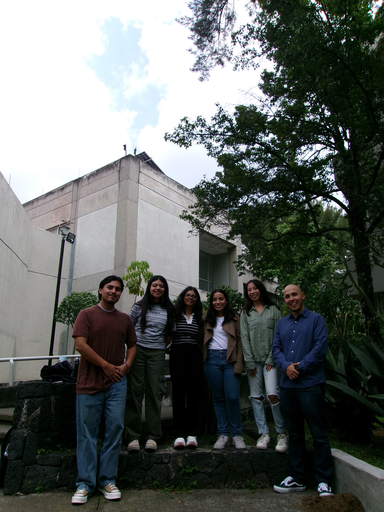

<!DOCTYPE html>
<html lang="en">
<head>
    <meta charset="UTF-8">
    <meta name="viewport" content="width=device-width, initial-scale=1.0">
    <title>Dr. Jorge Luis García Franco - Atmospheric Sciences</title>
    
</head>
<body>
    <!-- Hero Section -->
    <section class="hero">
        

            

                <h1>JLGF</h1>
                <h2>Associate Professor of Atmospheric Sciences</h2>
                
📍 Escuela Nacional de Ciencias de la Tierra 
                Universidad Nacional Autónoma de México (UNAM)

                
🌪️ Me gustan los tacos de tripa y las nubes que giran

                
🌊 Adjunct Research Scientist at Lamont-Doherty Earth Observatory

            

            

                
            

        

    </section>

    <!-- Research Section -->
    <section class="content-section">
        

            <h2 class="section-title">Research Focus</h2>
            

                
My current research aims to better understand <strong>tropical climate variability and change</strong>, especially regarding monsoons in the Americas. I am also interested in tropical cyclone prediction at the extended-range, participating in several projects of sub-seasonal-to-seasonal prediction (S2S).

            

            <h2 class="section-title" style="margin-top: 60px;">Selected Publications</h2>
            

                

                    1
                    <h3>MJO‐TC teleconnections and their influence on North American precipitation: Implications for subseasonal prediction.</h3>
                    
 Geophysical Research Letters, 2025. 

                    <a href="papers/paper1.pdf" class="paper-link">
                        Read Paper
                        →
                    </a>
                

                

                    2
                    <h3>Paper Title Two</h3>
                    
Brief description of your second paper. This could include the journal name, year, and key findings or contributions.

                    <a href="papers/paper2.pdf" class="paper-link">
                        Read Paper
                        →
                    </a>
                

                

                    3
                    <h3>Paper Title Three</h3>
                    
Brief description of your third paper. This could include the journal name, year, and key findings or contributions.

                    <a href="papers/paper3.pdf" class="paper-link">
                        Read Paper
                        →
                    </a>
                

                

                    4
                    <h3>Paper Title Four</h3>
                    
Brief description of your fourth paper. This could include the journal name, year, and key findings or contributions.

                    <a href="papers/paper4.pdf" class="paper-link">
                        Read Paper
                        →
                    </a>
                

                

                    5
                    <h3>Paper Title Five</h3>
                    
Brief description of your fifth paper. This could include the journal name, year, and key findings or contributions.

                    <a href="papers/paper5.pdf" class="paper-link">
                        Read Paper
                        →
                    </a>
                

            

        

    </section>

    <!-- Group Photo Section -->
    <section class="group-section">
        

            <h2 class="section-title" style="color: white;">Grupo de Modelación Climática Tropical</h2>
            

                
            

            
Integrantes del grupo:

            
Andrea Guadalupe Velázquez Cisneros

            
Integrantes del grupo:

            
Integrantes del grupo:

            
Integrantes del grupo:

        

    </section>

    <!-- CTA Section -->
    <section class="cta-section">
        

            <h3>Looking for Graduate Students</h3>
            
Currently seeking motivated students interested in pursuing a Masters or PhD degree at UNAM focusing on tropical climate dynamics and prediction.

            <a href="mailto:your.email@unam.mx" class="btn-primary">Get in Touch</a>
        

    </section>

    <!-- Links Section -->
    <section class="links-section">
        

            <h2 class="section-title">Resources & Projects</h2>
            

                

                    <h3>📚 About Me</h3>
                    
<a href="./about.md">Learn more about my background</a>

                

                

                    <h3>🔬 Research Projects</h3>
                    
<a href="./research.md">Detailed project descriptions</a>

                

                

                    <h3>👨‍🏫 Courses</h3>
                    
<a href="./courses.md">Teaching materials (en Español)</a>

                

                

                    <h3>🐍 PyDropsondes</h3>
                    
<a href="https://jlgarciafranco.github.io/PyDropsondes/">Python package for TC dropsonde analysis</a>

                

                

                    <h3>🌧️ MSTCP Dataset</h3>
                    
<a href="https://zenodo.org/doi/10.5281/zenodo.8322962">Tropical cyclone precipitation estimates</a>

                

                

                    <h3>🌍 Circulation Decomposition</h3>
                    
<a href="https://github.com/JLGarciaFranco/Local_walker_hadley">Local Hadley & Walker circulation code</a>

                

            

        

    </section>
</body>
</html>
